This repository reproduces the counterfactual bargaining algorithm from **Counterfactual Programming for Optimal Control**, validates it on numeric CMDPs, and extends it to logical (PCTL-style) constraints via augmented MDPs.

## Overview / Motivation

This repository is a reproducibility and extension study of the *Counterfactual Programming for Optimal Control* algorithm.

The original paper proposes a primal–dual bargaining mechanism that relaxes hard resource constraints by introducing endogenous slack variables, allowing agents to trade constraint violations against
objective value.

In this project, we:
1. Reproduce the original algorithm on numeric CMDPs.
2. Validate convergence behavior and constraint satisfaction.
3. Extend the approach to probabilistic temporal logic (PCTL) constraints using augmented MDPs and occupancy-measure LP formulations.

## Reference

This work is based on:

> **Counterfactual Programming for Optimal Control**  
>Luiz F. O. Chamon, Santiago Paternain, Alejandro Ribeiro, 2nd Annual Conference on Learning for Dynamics and Control / Proceedings of Machine Learning Research 120:1–10, 2020. 

All algorithmic choices marked as “paper-style” follow the original formulation unless stated otherwise.

## What Is Reproduced

- Counterfactual bargaining primal–dual loop
- Occupancy-measure LP formulation
- Endogenous slack variables with quadratic penalties
- Support for **multiple constraints** (energy, time, logic)
- Paper-style dual updates using previous-iterate residuals

## What Is Extended

- Unified LP formulation with arbitrary linear constraints
- Extension to **PCTL reachability and Until formulas**
- Augmented MDP construction with region and Until flags

## Repository Structure (In process of editing)

- grid/ # GridWorld and slip-MDP models
- numeric/ # Numeric CMDP bargaining experiments
- pctl/ # PCTL and Until specifications
- lp_solvers.py # Global LP baselines
- bargaining_numeric_constraints.py
- pctl_solvers.py # Augmented MDP + PCTL LP construction
- scripts/ # Reproducibility scripts
- configs/ # Experiment configs

## Mathematical Formulation

### CMDP and Occupancy Measures
We consider a finite Markov Decision Process

 

where *S* is a finite state space, *A* a finite action space, *T(s,a,s')* the probability transition matrix, and *s_0* the initial state.
Goal states are absorbing.

Instead of policies, we work with *occupancy measures*

 

which represent the expected number of times action *a* is taken in state *s*.

### Flow constraints

Occupancy measures satisfy the SSP flow constraints

 

which can be written compactly in matrix form as

 

### Objective and Resource constraints

Let c ∈ R^{|E|} denote the primary cost vector and f_i ∈ R^{|E|} denote linear resource cost vectors (e.g., energy, time), with corresponding budgets B_i ∈ R.

The hard-constrained CMDP is:

 

This problem may be infeasible or overly restrictive.

### Counterfactual Bargaining Relaxation

Following the counterfactual bargaining framework, each hard constraint is relaxed by introducing a nonnegative slack variable *s_i*:

 

The counterfactual bargaining framework does not modify the optimization problem directly. Instead, it introduces a *specification cost*
function

where *β_i* > 0 controls the cost of violating constraint *i*. 

We also optionally include a strongly convex regularizer (ρ^2 ∥x∥2)/2 with ρ > 0. 

The role of $h$ is not to regularize the objective, but to define a *compromise specification* that trades off performance improvement
against specification cost. Following paper formulation, the compromise specification *s†* is characterized by the condition

∇h(s) = λ*(s)

where λ*(s) denotes the optimal dual variables of optimisation problem for the specification *s*.

Algorithm 1 enforces this equilibrium implicitly by coupling the primal–dual dynamics with the inverse map s = (∇h)^{-1}(λ). For quadratic specification costs
h(s) = Σ_i (1/(2β_i)) s_i², this yields the explicit relation

  s_i = β_i λ_i,

which can be interpreted as an endogenously adjusted specification level that increases only when the corresponding constraint remains difficult to satisfy.

At equilibrium, the resulting saddle point corresponds to the KKT conditions of the following slack-augmented optimization problem:

The primal–dual algorithm in the paper enforces its optimality conditions implicitly via counterfactual updates of the dual variables.

### Algorithms Implemented

## Numeric Counterfactual Bargaining

**Problem setup**

We consider a stochastic shortest-path gridworld with slip probability 0.1.
The agent starts at **S** and aims to reach **G**, minimizing price while
satisfying energy and time budgets (possibly relaxed via bargaining).

**Cost grids:**

  
  
  

### Experiment overview

| Exp | β_E | β_T | E_max | T_max | Baseline | Bargained Price (raw) | Bargained Penalty |Bargained Total |
|----:|----:|----:|------:|------:|:--------:|------------:|--------:|------:|
| 1 | 1.5 | 1.5 | 3 | 3 | infeasible | 9.88 | 1.25 | 11.13 |
| 2 | 1.5 | 1.5 | 10 | 5 | feasible (6.98) | 6.61 | 0.19 | 6.80 |
| 3 | 10.5 | 1.5 | 10 | 5 | feasible (6.98)  | 4.47 | 1.25 | 5.72 |

**Experiment 1**

**Parameters**

- β_E = 1.5, β_T = 1.5
- E_max = 3, T_max = 3
- Slip = 0.1

**Baseline**
- Infeasible under hard constraints.

**Bargaining result**
- λ_E = 0.85 → slack_E = 1.27
- λ_T = 0.97 → slack_T = 1.46
- Raw price: 9.88
- Penalty: 1.25
- **Total cost:** 11.13

>Bargaining restores feasibility by relaxing both budgets, producing a
>stable policy that reaches the goal while paying a moderate penalty.

**Experiment 2**

**Parameters**

- β_E = 1.5, β_T = 1.5
- E_max = 10, T_max = 5
- Slip = 0.1

**Baseline**
- Feasible = 6.98.

**Bargaining result**
- λ_E = 0.5 → slack_E = 0.75
- λ_T = 0.02 → slack_T = 0.03
- Raw price: 6.61
- Penalty: 0.19
- **Total cost:** 6.8

>Although the baseline is feasible, bargaining slightly relaxes constraints
>to reduce price, paying a negligible penalty.

**Experiment 3**

**Parameters**

- β_E = 10.5, β_T = 1.5
- E_max = 10, T_max = 5
- Slip = 0.1

**Baseline**
- Feasible = 6.98.

**Bargaining result**
- λ_E = 0.48 → slack_E = 5.02
- λ_T = 0.26 → slack_T = 0.39
- Raw price: 4.47
- Penalty: 1.25
- **Total cost:** 5.72

>Increasing β_E encourages the solver to violate energy more aggressively,
>leading to a substantially cheaper raw path at the expense of higher slack cost.

### Convergence behavior

Across all experiments, the primal iterate difference
‖xᵗ − xᵗ⁻¹‖₁ decreases to near-machine precision.

Key patterns:
- Initial oscillations due to dual updates
- Log-linear decay after effective budget stabilization
- Faster convergence once slacks settle

  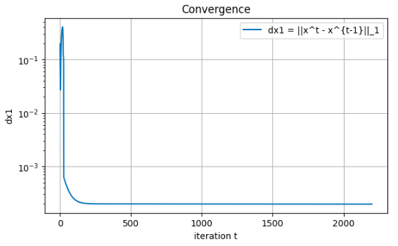
  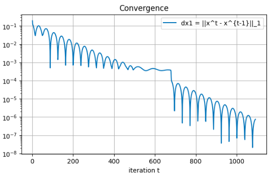
  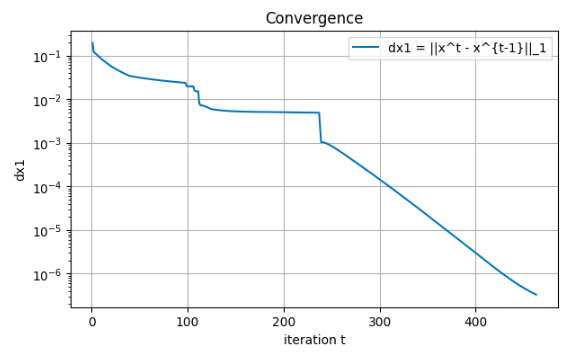

  
### Final policies

Below we show the induced stochastic policies for each experiment.
Arrow length corresponds to action probability.

  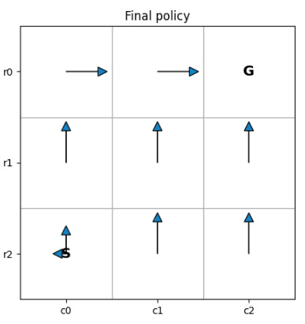
  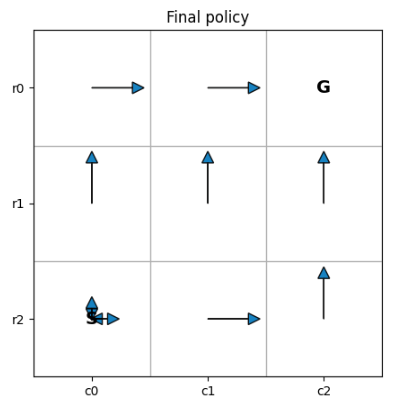
  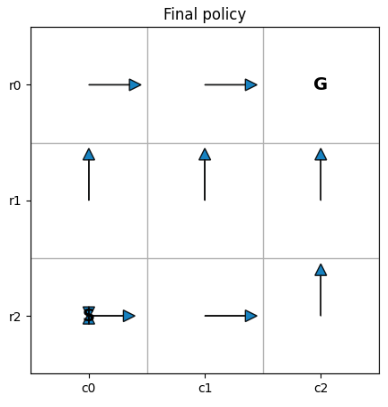

##  PCTL / Until Extension

### Experiment 4 — PCTL Avoidance under Slip (Baseline Infeasible)

**World:** 5×5 grid, slip=0.1  
**Unsafe region:** G2 (highlighted below)  
**Spec:** P(♦ G2) ≤ 0 (avoid with 100% probability)  
**Goal:** reach G

  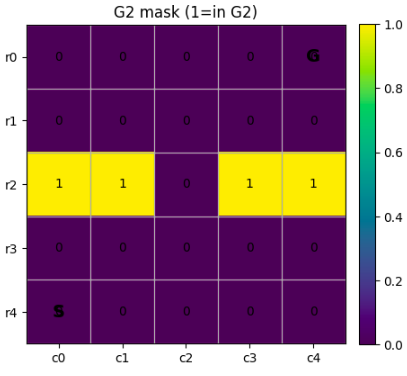

## Baseline (hard spec)
Baseline LP is infeasible under slip=0.1 with the hard avoidance bound P(♦G2) ≤ 0.

## Bargaining results (two β settings)

| β (for G2) | Original prob. |  Baseline cost |Bargained  prob. | P(♦G2) achieved | Bargained raw cost | Bargained penalty | Bargained total cost |
|---:|---:|---:|---:|---:|---:|---:|---:|
| 0.1  | 0.000000 | inf |0.195174 | 0.195174 | 8.837238 | 0.190465 | 9.027707 |
| 0.01 | 0.000000 | inf |0.114409 | 0.113839 | 9.092274 | 0.654475 | 9.746752 |

Interpretation: smaller β makes relaxing the spec more expensive, so the algorithm chooses a smaller probability threshold but pays a larger penalty.

### β = 0.1

  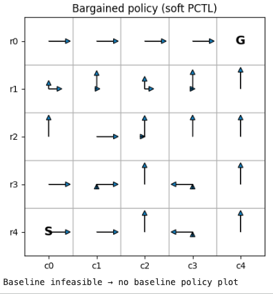
  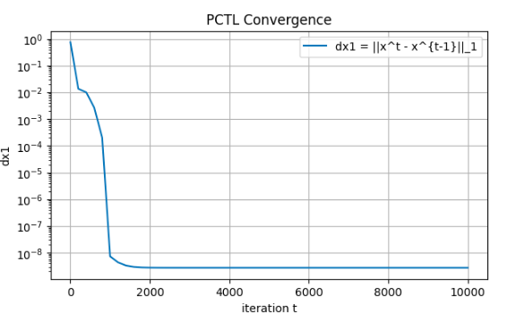

### β = 0.01

  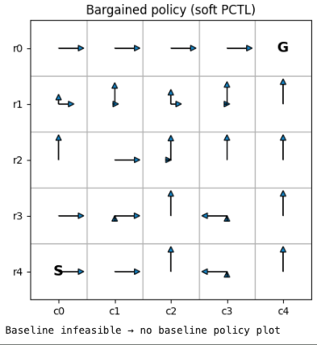
  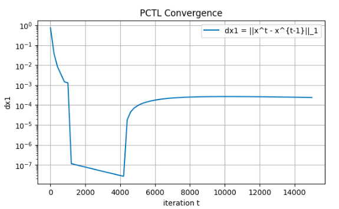

### How to Reproduce Results

#### Numeric Experiments
#### PCTL Experiments

### Expected Outputs

### Notes on Differences from the Paper

### Limitations & Future Work

### Citation
